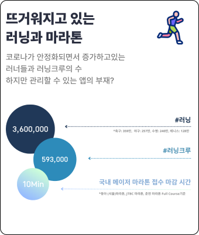
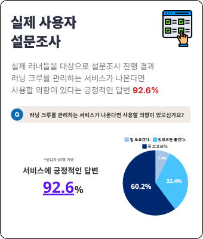
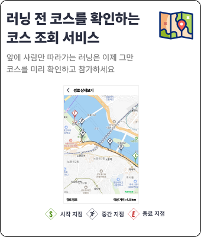

# 러닝 크루 통합 관리 플랫폼 [CREW-IN](https://crew-in.site/login)

## 팀 소개

## 프로젝트 소개
### 1️⃣ 기획의도

#### WHY ❓
    
    - 기존 크루 운영 방식에는 여러가지 문제점이 있습니다.
    - 매번 새로운 세션을 생성할 때마다 카카오톡 방이 생성되어 관리하기 어렵습니다.
    - 러닝 일정 관리, 러닝 인원 관리 등에 어려움을 겪고 있습니다.
    - 누가 몇번 세션에 참여했는지 수기로 작성하고 있어서 크루원 관리가 번거롭습니다. 
    
#### HOW 💡
    
    1. 크루 운영 관리
    - 크루 생성, 수정, 권한 부여(캡틴, 페이서, 멤버로 구분)
    
    2. 러닝방 운영 관리
    - 정규런, 오픈런, 번개런으로 나누어 러닝방 오픈 및 위치 기반으로 인원 관리 도입
    
    3. 경로 관리
    - 러닝방 오픈할때 직접 러닝 코스 지정 
    
    4. SNS 커뮤니티
    - 크루별로 사진 프레임을 제공
    - 러닝 기록 및 크루 로고를 통해 유대감 형성
    - 사용자 자체 제작 사진 공유
    - 게시글 태그 기능
    
#### WHAT 🏃‍♀️🏃‍♂️
    
    [러닝 크루 통합 관리 플랫폼 CREW-IN]
    
    1. 효율적인 크루 관리
    - 크루 생성, 조회, 검색 기능
    - 역할에 따른 권한 차등 부여
    
    2. 커뮤니티 활성화
    - 활발한 정보 공유와 참여 유도
    - 게시글 공개범위(전체/크루) 구분
    
    3. 러닝 경험 최적화
    - 세션 코스 조회 기능
    - 코스 만들기 기능 
    
    

### 2️⃣ 서비스 기능

### 3️⃣ 프로토타입

### 4️⃣ 시스템 구조도 & ERD 

### 5️⃣ 핵심 기술 

